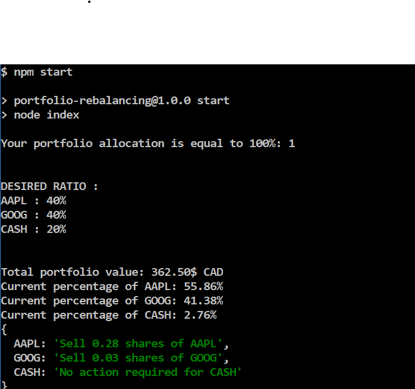

# portfolio-rebalancing
Help you rebalance your portfolio

## Geting started
1. Install the latest stable version of node js (LTS) (THE ONE ON THE LEFT) (link)[https://nodejs.org/en]
2. Edit the variable at the top in the `index.js` file
2. run `npm start` or `node index.js`

## Output exemple 

